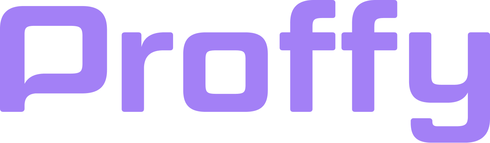

<h4 align="center">
<br>

 <b>A sua plataforma de estudos online </b> 👨🏾‍🏫 👨🏾‍🎓
</h4>
<p align="center">
  
  
  
  
  
    
  <a href="https://rocketseat.com.br">
    </a>
    
</p>

<br>

### :rocket: Tecnologias usadas

Esse projeto foi desenvolvido com as seguintes tecnologias:

- [ReactJS](https://pt-br.reactjs.org/)
- [Styled Components](https://styled-components.com/)
- [TypeScript](https://www.typescriptlang.org/)

Extras:

- Main Libs

  
- Estilos

  - [EditorConfig](https://editorconfig.org/)
  - [ESLint](https://eslint.org/)
  - [Prettier](https://prettier.io/)

### 💻 Demo Web

[Em breve](#)

### 📱 App

[Em breve](#)

### 💻 Projeto

<b>Proffy</b> é uma plataforma de estudos onlines para alunos encontrarem professores de diversas matérias para focar nos estudos de forma online.

### ⚙ Como rodar este projeto

Podemos considerar este projeto como sendo divido em três partes:

1. Backend (em desenvolvimento)
2. Frontend
3. Mobile (em desenvolvimento)

<b>💡 Tanto o Frontend quanto o Mobile precisam que o Backend esteja sendo executado para funcionar.</b>

### Pré-requisitos

Antes de começar, você vai precisar ter instalado em sua máquina as seguintes ferramentas:

<b>[Git](https://git-scm.com)</b>

<b>[Node.js](https://nodejs.org/en/)</b>

E também será preciso um editor, eu indico o <b>[VSCode](https://code.visualstudio.com/)</b>


### 🧭 Rodando o Frontend

```bash
# Clone este repositório
$ git clone https://github.com/ialexanderbrito/proffy

# Acesse a pasta do projeto no seu terminal/cmd
$ cd proffy

# Vá para a pasta da aplicação FrontEnd
$ cd frontend

# Instale as dependências
$ npm install ou yarn

# Execute a aplicação
$ npm start ou yarn start

# A aplicação será aberta na porta:3000 - acesse http://localhost:3000
```

### :recycle: Como contribuir

- Fork esse repositório;
- Crie uma branch com a sua feature: `git checkout -b my-feature`
- Commit suas mudanças: `git commit -m 'feat: My new feature'`
- Push a sua branch: `git push origin my-feature`

Depois que o merge da sua pull request for feito, você pode deletar a sua branch.

### :mortar_board: Quem ministrou?

A Next Level Week foi ministrada pelo [Diego Fernandes](https://github.com/diego3g)

### :memo: Licença

Esse projeto está sob a licença MIT. Veja o arquivo [LICENSE](LICENSE) para mais detalhes.

### 📱 Social

Me acompanhe nas minhas redes sociais.

<p align="center">

   <a href="https://twitter.com/ialexanderbrito" target="_blank" > 
     </a> 
  
  <a href="https://instagram.com/ialexanderbrito" target="_blank" >
    </a> 
  
  <a href="https://facebook.com/ialexanderbrito" target="_blank" >
    </a> 

  <a href="https://www.linkedin.com/in/ialexanderbrito/" target="_blank" >
    </a> 
  
  <a href="mailto:ialexanderbrito@gmail.com" target="_blank" >
    </a> 
  
  <a href="https://api.whatsapp.com/send?phone=5521979434402" target="_blank" >
    </a>
    
   <a href="https://t.me/ialexanderbrito" target="_blank" >
    </a>
    
</p>

---

Feito com ❤️ by **Alexander** 🤙🏾
